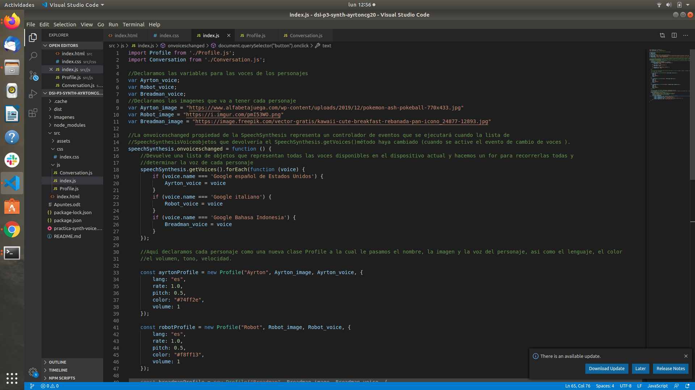

### Práctica Game Dialogue Synth

En la siguiente práctica, vamos a utilizar la API de síntesis de voz del navegador para construir un sistema simple de diálogos para un juego. El objetivo es crear varios perfiles de personajes, cada uno con sus propias características particulares. Se aconseja utilizar la siguiente organización:

  - Una clase Profile para guardar las características del personaje, donde se pueden encontrar cosas como la velocidad de diálogo, el avatar del personaje o el color del texto. Por ejemplo:

```
const manzProfile = new Profile("Manz", {
  lang: "es",
  rate: 2.0,
  pitch: 1.0,
  color: "#ff0000",
});
```

- Una clase Conversation para trabajar y controlar las conversaciones de todos los personajes. Una conversación se podría definir como un array de objetos, donde cada uno contiene la frase y el personaje que la pronuncia.


```
const conversation = new Conversation(box);

conversation.addMessage([
  { author: manzProfile, text: "¡Hola a todos! ¿Qué tal están?" },
  { author: robotProfile, text: "Muy bien, ¡gracias!" },
  { author: breadmanProfile, text: "Yo también muy bien" },
  {
    author: manzProfile,
    text: "El robot habla con un acento un tanto raro...",
  },
  { author: robotProfile, text: "Es que soy del norte" },
]);
```

1. Implementa la clase Profile para definir las características del personaje.
2. Implementa la clase Conversation para definir la conversación global y su manejo del sintetizador de forma que sea ajeno a la página principal.
3. La forma más fácil de implementar el sistema de diálogos es haciendo que muestre cada frase de golpe. ¿Serías capaz de implementarla de forma que aparezca palabra a palabra, a medida que la pronuncia? (Pista: hay que usar eventos)
4. Separa en métodos de clase para que puedas decidir si utilizar el método wordToWord() para que el personaje muestre el texto palabra a palabra, o el método letterToLetter() para que muestre letra a letra, como en el juego Undertale. Implementa también un método para que reproduzca un sonido en cada letra. Puedes utilizar Bxfr (requiere Flash/Adobe Air) para generarlos.
5. Genera el build y haz el despliegue en GitHub Pages, de modo que se pueda ver el ejemplo en vivo.


Lo primero que hemos hecho es crear los directorios de la práctica con el fin de tener la práctica bien estructurada. 
En este caso el árbol de directorios sería el siguiente:

Dsi-p3-synth-ayrtoncg20
  .cache
  .dist
  imagenes
  node_modules
  src
    assets
    css
      index.css
    js
      Conversation.js
      index.js
      Profile.js
    index.html
  package.json
  package-lock.json
  README.md
  
Una vez hemos hecho las carpetas comenzamos a desarrollar el código

Lo primero que creamos es el index.html donde podemos observar que hacemos uso de css y de javascript para poder añadir las clases. Declaramos un boton para comenzar el juego llamado play. 


Lo siguiente que hice fue crear el archivo index.js 

En este archivo tenemos que importar las clases que vamos a utilizar en este caso la clase Profile y la clase Conversation. Declaramos una serie de variables para los personajes, la imagen y la voz que definiremos a continuación. Buscamos las voces que tiene nuestro navegador y las asignamos a las variables creadas anteriomente, lo mismo con las imagenes aunque en este caso solo hay que igualar. 

A continuación creamos los objetos de la clase Profile, al cual le pasamos el nombre, la imagen, la voz y una serie de propiedades como el lenguaje el volumen, el color del texto...

También creamos un objeto conversacion y le pasamos por parametro el chat

Una vez que toquemos el boton de play el chat se pondra visible. 

Le añadimos los mensajes al objeto conversacion como está definido en la práctica. 




A continuacion tenemos que crear la clase profile, en esta clase estarán los atributos de cada personaje.

Creamos una clase con el nombre, la imagen, la voz y un array de propiedades donde se encuentran almacenadas todas las demás. El nombre de este objeto es igual al nombre que le paso por parámetro al crear el objeto en el index.js


Por último se crea la clase Conversation a la cual se le pasa por parametro un chat que va a ser el cuadro de texto donde se reproduciran los textos de los personajes. 

Llamamos a la funcion llamada addMessage. Metemos en texto todo lo que hay en addMessage para luego poder acceder a ello con el metodo map, una vez hecho esto ya podemos crear un mensaje msg y agregarle todas las propiedades para despues mostrarlas por pantalla con un innerHTML y la funcion speechSynthesis.speak(msg) vista en los videos de introducción a la práctica


